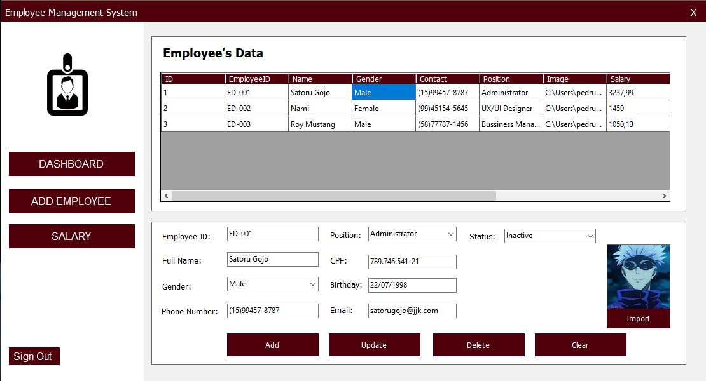

# Employee Management System

## Overview
The Employee Management System is a C# application designed to streamline the management of employee records. Built using Visual Studio and .NET, the application features a user-friendly dashboard for managing employees and their information, including salary updates, active/inactive status, adding, updating, and deleting records, as well as login and registration functionalities.

## Features
- **Dashboard Overview**:
  - Display a comprehensive summary of active, inactive, and total employees.
  - Visual indicators for employee status, providing quick insights.

- **Employee Management**:
  - **Add New Employees**: Easily add new employee records with details such as name, position, salary, and status.
  - **Update Employee Details**: Edit employee information, including name, position, salary, and employment status.
  - **Delete Employee Records**: Remove employees from the system with a single click.
  - **Salary Management**: Update and manage employee salaries.

- **User Authentication**:
  - **Registration**: Register new users with required details for system access.
  - **Login**: Secure login functionality with password protection for authorized users only.

## Technology Stack
- **Language**: C#
- **Framework**: .NET Framework
- **Database**: SQL Server (for storing employee data)
- **IDE**: Visual Studio

## Installation
### Prerequisites
- [Visual Studio](https://visualstudio.microsoft.com/) with .NET desktop development workload.
- [SQL Server](https://www.microsoft.com/en-us/sql-server/sql-server-downloads) to host the employee database.

### Setup
1. Clone the repository:
   ```bash
   git clone https://github.com/yourusername/employee-management-system.git

2. Open the solution file (.sln) in Visual Studio
3. Update the connection string in Salary.cs to match your SQL Server settings:
    ```bash
    private readonly string connectionString = @"Data Source=localhost;Initial Catalog=projetoProgramacaoVIII;Integrated Security=True";
4. Run the SQL script provided in the /database folder to create the necessary database tables.
5. Build and run the application from Visual Studio.

## Database Schema

To create the necessary tables for the project, use the following SQL script:

```sql
CREATE TABLE users (
	id INT PRIMARY KEY IDENTITY(1,1),
	cpf VARCHAR(30) NULL,
	email VARCHAR(50) NULL,
	telefone VARCHAR(50) NULL,
	username VARCHAR(100) NULL,
	password VARCHAR(100) NULL,
	date_register DATE NULL
);

CREATE TABLE employees (
	id INT PRIMARY KEY IDENTITY(1,1),
	employee_id VARCHAR(30) NULL,
	status VARCHAR(30) NULL,
	full_name VARCHAR(50) NULL,
	contact_number VARCHAR(30) NULL,
	gender VARCHAR(15) NULL,
	cpf VARCHAR(30) NULL,
	birthday VARCHAR(30) NULL,
	email VARCHAR(50) NULL,
	position VARCHAR(50) NULL,
	image VARCHAR(MAX) NULL,
	salary DECIMAL(18,2) NULL,
	insert_date DATE NULL,
	update_date DATE NULL,
	delete_date DATE NULL
);
```

## Usage
- Login with your registered credentials to access the dashboard.
- Navigate through the dashboard to:
  - View summaries of active, inactive, and total employees.
  - Add, update, or delete employee records.
  - Adjust salaries as needed.

## Screenshots
**Login/Register**: User authentication screens for secure access.


**Dashboard**: Displays key metrics of employees, including active, inactive, and total counts.


**Employee Details**: Form for adding and updating employee information.



## Contributing
Feel free to submit issues or pull requests. For major changes, please open an issue first to discuss what you would like to change.

## License
This project is licensed under the MIT License.